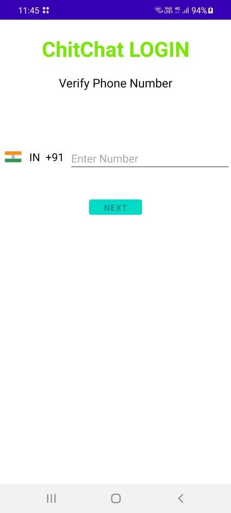
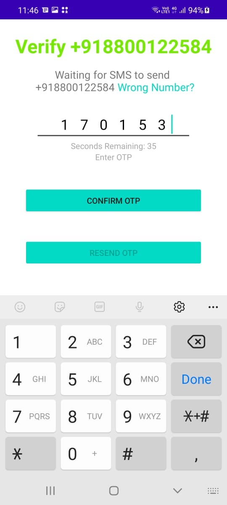
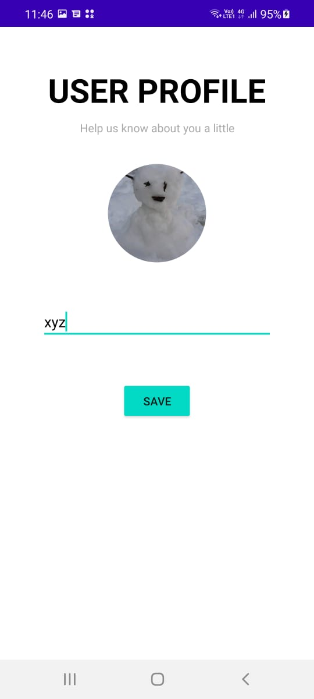
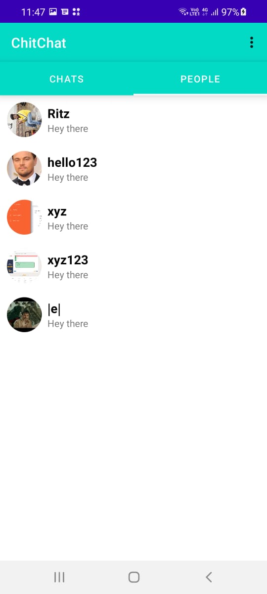
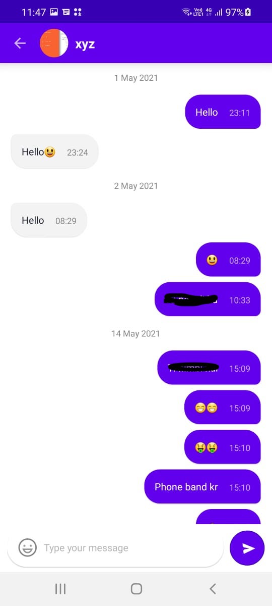

<h1 align="center">ChitChat</h1>

<b>It is used for realtime messaging application
  </b>

## Tech and framework used
* Kotlin
* Firebase
   * Firebase Storage
   * Firebase Realtime Database
   * Firebase Firestore

## Screenshots

 
  
   
 
   
